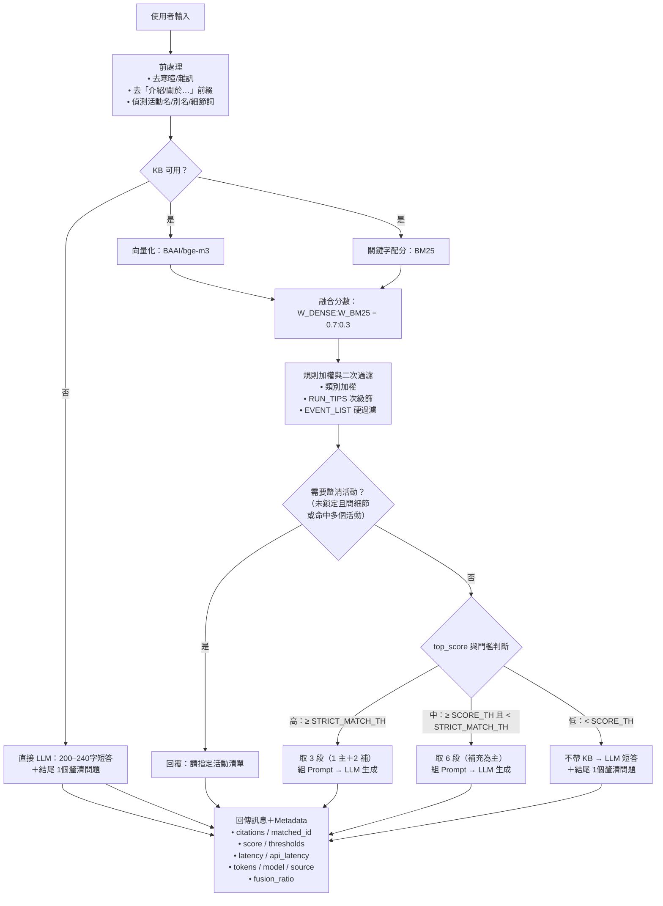

TriathlonRAG
===
📌 專案簡介
---
### 本專案旨在建立一個支援中文對話的鐵人三項專題 AI 聊天機器人，結合**RAG（Retrieval-Augmented Generation）**與**本地 Llama 3（Meta-Llama-3-8B-Instruct）模型**，並部署於 LINE 官方帳號，提供使用者即時問答與資訊檢索。
### 知識庫來源為整理後的 鐵人三項 FAQ 資料，採用向量檢索（FAISS）加速查詢，並支援本地端推論以避免雲端 API 成本。
### 以 BAAI/bge-m3 做 Dense 檢索、BM25 關鍵字檢索做加權融合，並結合規則過濾（活動導向、跑步情境），再交由 LLM 生成最終回答。支援依活動名澄清、上下文條件記憶（每週練習次數、室內飛輪、可連續游距離等），以及 LINE Bot 介面。

🚀 特色 × 使用技術
---
- **RAG 核心檢索**
  - **向量模型**：BAAI/bge-m3（可替換），FAISS 建索引。 
  - **融合策略**：Dense + BM25 加權（W_DENSE/W_BM25 可調）。 
  - **命中分支**：STRICT_MATCH_TH、SCORE_TH 控制 high/mid fuse 與 LLM fallback。
- **雙知識庫架構**
  - events（活動）與 faq（常見問答）各自建索引，啟動時合併檢索。 
  - 事件詞典：從 meta 建立「名稱/別名 → 標準活動」映射。 
  - 缺漏報告：events_missing.json 提醒建議補欄但不擋流程。
- **LLM 生成與中文本地化**
  - 本地 LLM（預設 Llama 3）生成最終答覆；固定「結論先行 + 條列重點」。 
  - 自動繁中本地化、去除英文尾註/emoji/雜訊，避免中英夾雜。
- **意圖與互動體驗**
  - **意圖路由**：EVENT_LIST / RUN_TIPS / TRAINING_PLAN / RACE_RULES / DISTANCE_DEF / DEFINITION。 
  - 活動細節偵測（地點/時間/費用…）→ 未鎖定時先澄清活動。 
  - 未知活動：要求官方連結或城市/日期/主辦後再進一步回答。 
  - 寒暄降噪：偵測數字/單位/訓練詞或活動提及時跳過問候。
- **上下文與條件記憶（in-memory）**
  - 記住使用者條件（如每週次數、每次時長、室內飛輪、連續游距離），自動帶入後續 Prompt。 
  - 滑動續期 Session TTL（預設 180 分），活動 TTL 獨立（預設 60 分）避免誤綁舊活動。 
  - LRU 容量上限（預設 20,000）保護記憶體。
- **澄清與防幻覺**
  - 低分情境走 LLM 指導式回覆 + 1 個澄清問題。 
  - 活動相關回答只引用 KB；無資料即誠實告知並請求補充。
- **平台整合與 API**
  - REST 端點：/query（回傳 citations/score/fusion_ratio/usage 等 meta）。 
  - LINE Messaging API 已串接（可擴充 FB Messenger）。
- **觀測與治理**
  - 健康檢查：/health（模型/索引尺寸/LLM ping）。 
  - 動態日誌層級：/admin/loglevel（需 ADMIN_TOKEN）。
- 安全（可擴充） 
  - 以 HTTPS、OAuth2 部署；祕密金鑰與閾值皆以 .env 管理。

💻  環境需求
---
```env_requirements = 
Python >= 3.10
套件依 requirements.txt 安裝
FAISS 安裝注意事項：
Windows：建議安裝 faiss-cpu（無 GPU 加速）
macOS / Linux：可安裝 faiss 或 faiss-gpu（需支援 CUDA）
本地 Llama API 啟動：可使用 LM Studio 或其他支援 OpenAI API 格式的推論伺服器，需設定與 .env 中 RAG_API_URL 相同的 Port。
```
🧩 查詢邏輯（RAG 工作流）
---
1. 取得使用者輸入 → 前處理（去寒暄、去「介紹/關於」前綴、偵測活動名/細節詞）。
2. 將查詢用 BAAI/bge-m3 轉向量，並以 BM25 同步算關鍵字分數。
3. 融合分數（W_DENSE:W_BM25 = 0.7:0.3），套規則加權與二次過濾。
4. 根據 top_score 與門檻分支：
   - High（≥ STRICT_MATCH_TH）：取 3 段（primary + extras）→ LLM。 
   - Mid（≥ SCORE_TH 且 < STRICT_MATCH_TH）：取 6 段 → LLM。 
   - Low（< SCORE_TH）：不帶 KB，直接 LLM 短答 + 釐清問題。
5. 回覆並附帶 metadata（citations、分數、用時、token…）。


🧭 系統架構（Mermaid 流程圖）
---



📂 專案結構
---
```
triathlon/
│
├── main.py                     # LINE Webhook 主程式
├── rag_api.py                  # RAG 主流程與 REST 端點
├── build_kb.py                 # 由 events.csv / faq.csv 建立 KB 與索引
├── logger.py                   # 統一專案內的日誌設定，讓每個模組以相同格式與等級輸出到主控台
├── services/                   # 後端服務模組
│   ├── __init__.py             # 標記 services 為套件（可放初始化邏輯）
│   ├── retriever.py            # 檢索融合、規則過濾、意圖輔助（BM25 + Dense）
│   └── llm_client.py           # 與 LLM 溝通的薄封裝
├─ data/                        # 知識庫
│  └─ kb/
│     ├─ events/                # events_ids.json / texts.json / meta.json / events.index
│     └─ faq/                   # faq_ids.json / texts.json / meta.json / faq.index
├── tests/                      # 測試紀錄
│   └── dialogue_test.md        # 測試對話紀錄
├─ config.py            # 讀取 .env + 預設常數 + 路徑
├─ .env                 # 私密金鑰與可調參數（見下）
├─ requirements.txt
└── README.md                   # 本文件
```

📦 安裝與環境
---
```bash
# 安裝套件
pip install -r requirements.txt
```
必要套件：
- `flask`
- `requests`
- `sentence-transformers`
- `faiss-cpu`
- `numpy`
- `pandas`
- `gspread`
- `oauth2client`
- `python-dotenv`

🚀 啟動方式
---
1. 先建立知識庫索引：
   ```bash
   python build_kb_index.py
   ```
2. 啟動 RAG API：
   ```bash
   python rag_api.py
   ```
3. 確認本地 Llama API（LM Studio）已啟動：
   ```
   http://127.0.0.1:1234/v1/chat/completions
   ```
4. 將 LINE OA webhook 指向 Flask 服務。

🔍 查詢邏輯
---
1. **前處理與意圖判定**
   - 先做去前綴（例如「請介紹…」）、去寒暄、用詞正規化。
   - 解析意圖：`EVENT_LIST / RUN_TIPS / TRAINING_PLAN / RACE_RULES / DISTANCE_DEF / DEFINITION / NO_CONTEXT / MISC`。
   - 從文字抽取「活動名/別名」。若只像是活動名但不在庫，直接請用戶補官方連結或基本資訊（城市/日期/主辦）並暫存為本輪的 active_event。
   - 對話記憶：以 `session_id/line_id` 維持 `active_event`（滑動 TTL），避免連問時每次都要重複指名。
2. **檢索查詢組裝**
   - 若已鎖定 `active_event` 且本輪只問細節（如「地點/時間/費用」），會將查詢改寫為：`{active_event} + {細節詞}`，提升命中率。
   - 查詢同時走 Dense 檢索（BAAI/bge-m3 向量、FAISS）與 BM25 關鍵字檢索，得到候選段落。
3. **分數融合與規則過濾**
   - 以 `W_DENSE` 與 `W_BM25` 權重做分數融合。
   - 套用情境規則（例如跑步安全文優先、非相關分類扣分）。
   - 若已鎖定活動，僅保留該活動的段落；若同時命中多個活動或沒有鎖定且問題是活動細節 → 先發釐清問題要用戶選活動。
4. **分支決策（依最高分 `top_score`）**
   - `top_score` < SCORE_TH → Low（LLM-only）：不帶 KB，直接由 LLM 在 240 字內回應，並附 1 個澄清問題。
   - SCORE_TH ≤ top_score < STRICT_MATCH_TH → Mid（mid_fuse）：取前 6 段，合併成「主要/補充段落」，交 LLM 生成。
   - top_score ≥ STRICT_MATCH_TH → High（high_fuse）：取前 3 段，明確標示「主要知識段落 + 補充段落」，交 LLM 生成。
   - 主要/補充上下文總長受 `MAX_CTX_CHARS` 限制。
5. **特殊路徑**
   - DEFINITION / NO_CONTEXT：使用精簡中立系統提示，僅依 KB（5 段內）做 20–60 字定義；不足則回「資料不足」。
   - 寒暄偵測：若訊息只有打招呼且沒有領域線索，回「角色式問候」；但只要看起來像活動詢問（或含細節詞），就略過寒暄直接進檢索/釐清。
   - KB 不可用（索引未載入/空）：走 LLM-only，活動細節題會先詢問「你指的是哪個活動？」
6. **回覆與後處理**
   - 強制繁中本地化與專有名詞正規化。
   - 回傳同時附上 `meta`：`source / intent / score / thresholds / fusion_ratio / citations / matched_id / usage / model / latency`，方便日誌與觀測。
7. **對話記憶**
   - .env 可調（建議值）：
     - `ESS_TTL_MIN=180`（Session 3h、滑動續期）
     - `ACTIVE_EVENT_TTL_MIN=60`（活動 60 分；逾時自動失效）
     - `MAX_SESS=20000`（超過淘汰最舊）
   - 若活動 TTL 到期或連續多輪未再提及，回答前會簡短確認「仍以 XXX 活動為主嗎？」
8. **資料面向**
   - 目前合併兩庫檢索：`events`（活動結構化段落）＋ faq（FAQ 段落），以相同向量空間與融合規則處理。
   - `events` 內若缺 `reg_url`、`city` 等欄位，回覆會明確說明**資訊未提供**並換行附上判定依據（例如「此欄位在活動資料中為空」）。

⚖️ 參數設定
---
### 本專案的檢索與回覆行為可透過 `.env` 進行調整，主要參數如下：
### 🔍 檢索與生成控制
- `top_k`：檢索返回的筆數（預設 `5`）
- `top_p`：LLM 生成的 nucleus sampling（預設 `0.9`）
- `STRICT_MATCH_TH`（嚴格命中閾值，預設 `0.72`）：
  - 當檢索分數 ≥ 此值時，會在 Prompt 中將其標記為「主要知識段落」並進行融合
  - 數值越高 → 越不容易被判定為高分命中
  - 數值越低 → 越容易進入高分命中（可能過於死板）
- `SCORE_TH`（最低檢索分數，預設 `0.40`）：
  - 當混分後 < 此值時，直接視為「知識庫沒命中」，交給 LLM 生成回覆
  - 數值越高 → 低分內容會被更嚴格地忽略
  - 數值越低 → 命中門檻更寬鬆（可能帶入無關內容）
- `W_DENSE`（Dense 語義檢索權重，預設 `0.70`）：
  - 偏重語義相似度（理解意思）
  - 例如中文中「好快樂」與「好不快樂」雖然極性相反，但因語意相近，Dense 可能給高分
- `W_BM25`（BM25 關鍵字檢索權重，預設 `0.30`）：
  - 偏重字面關鍵字匹配
  - 例如「好快樂」與「好不快樂」字面差異較大，因此 BM25 分數會較低
  - 建議 `W_DENSE + W_BM25 ≈ 1.0`
- `SESS_TTL_MIN`（整體 session，預設 `180`）
  - 每個使用者（或 `session_id/line_id`）的會話狀態（例如最近問題、部份上下文旗標）會存在記憶體中，超過這個時間無互動就自動失效
  - 滑動 TTL（sliding）——每次有請求就刷新時間戳，等同重新計時 180 分鐘，能在同一段對話期間保留必要的上下文，又避免長期佔用記憶體
  - 建議值 120–240 分；太短會讓上下文容易掉、太長會增加記憶體壓力
- `ACTIVE_EVENT_TTL_MIN`（活動相關詢問失效時間，預設 `180`）
  - 針對「已鎖定的活動名稱」（`active_event`）設定更短的壽命。使用者若一段時間沒有再提到該活動，綁定自動清除，避免把新問題誤解為同一活動
  - 建議值 30–90 分；活動細節通常是短期任務，不宜過長
- `MAX_SESS`（session 對話紀錄筆數記憶體上限，超過就淘汰最舊，預設 `20000`）
  - 限制同時存在記憶體中的 session 數量上限。超過上限時，系統會**淘汰最舊**（近似 LRU）的會話，以防記憶體逐步被吃滿
  - 提供簡單、可預測的上限，降低長時間運行的風險（特別是高併發或忘記清理的情況）
  - 若單一 session 狀態極小（僅字串與時間戳），2–3 萬通常可行；若未來要加大上下文快取，就應酌量調低

### 🔑 外部服務金鑰與認證
- `LINE_CHANNEL_ACCESS_TOKEN`：LINE Messaging API 的存取權杖，用於驗證與發送訊息。
- `LINE_CHANNEL_SECRET`：LINE Messaging API 的通道密鑰，用於驗證 Webhook 請求來源。
- `GOOGLE_SA_JSON`：Google Service Account JSON 憑證路徑，用於 Google Sheets API 寫入對話記錄。

📄 .env 範例
---
```env_example = 
# 請在專案根目錄建立 `.env` 檔案，並填入以下內容：

LINE_CHANNEL_ACCESS_TOKEN=你的LINE Channel Access Token
LINE_CHANNEL_SECRET=你的LINE Channel Secret
GOOGLE_SA_JSON=你的Google Service Account JSON字串（單行）

# ---- 檢索與命中判斷 ----
STRICT_MATCH_TH=0.72     # 嚴格命中，走 high fuse
SCORE_TH=0.40            # 最低採納分數，低於走 LLM fallback
W_DENSE=0.70             # Dense 權重
W_BM25=0.30              # BM25 權重

# ---- 會話與活動 TTL（務實配置）----
SESS_TTL_MIN=180         # 整體 session 3 小時（滑動續期）
ACTIVE_EVENT_TTL_MIN=60  # 活動鎖定 60 分鐘自動失效
MAX_SESS=20000           # in-memory 容量上限（超過採 LRU 淘汰）

```

📊 Google Sheets 權限設定
---
### 1. 建立一個 Google 試算表，名稱可自訂。 
### 2. 確認第一列欄位順序與程式一致：`line_id`、`line_name`、`line_chat`、`timestamp`、`role`、`meta_json`。 
### 3. 將該試算表「分享」給 Service Account（`GOOGLE_SA_JSON` 中的 `client_email`）。 
### 4. 權限至少需要「編輯者」，否則程式無法寫入。

📜 對話記錄欄位說明
---
### 本專案會將每一次的對話記錄寫入 Google Sheets，方便日後分析、除錯與模型優化。對話資料以表格形式儲存，欄位定義如下：

| 欄位名稱          | 說明                                                                                                                                                                                                                                                                                                                                                                                                                                                                                                                                                                                                                                                                                                                                                                                                                                                                                                                                                                                                                                                                                                                                                                                                                                                                                                                                                                                                                                                                                                                                                                                                                                                                                                                                                                                                                                                                                                                                             |
|---------------|------------------------------------------------------------------------------------------------------------------------------------------------------------------------------------------------------------------------------------------------------------------------------------------------------------------------------------------------------------------------------------------------------------------------------------------------------------------------------------------------------------------------------------------------------------------------------------------------------------------------------------------------------------------------------------------------------------------------------------------------------------------------------------------------------------------------------------------------------------------------------------------------------------------------------------------------------------------------------------------------------------------------------------------------------------------------------------------------------------------------------------------------------------------------------------------------------------------------------------------------------------------------------------------------------------------------------------------------------------------------------------------------------------------------------------------------------------------------------------------------------------------------------------------------------------------------------------------------------------------------------------------------------------------------------------------------------------------------------------------------------------------------------------------------------------------------------------------------------------------------------------------------------------------------------------------------|
| **line_id**   | 使用者的 **LINE 唯一識別碼（User ID）**，用於區分不同用戶。                                                                                                                                                                                                                                                                                                                                                                                                                                                                                                                                                                                                                                                                                                                                                                                                                                                                                                                                                                                                                                                                                                                                                                                                                                                                                                                                                                                                                                                                                                                                                                                                                                                                                                                                                                                                                                                                                                         |
| **line_name** | 使用者的 **LINE 顯示名稱（Display Name）**，方便人工辨識。                                                                                                                                                                                                                                                                                                                                                                                                                                                                                                                                                                                                                                                                                                                                                                                                                                                                                                                                                                                                                                                                                                                                                                                                                                                                                                                                                                                                                                                                                                                                                                                                                                                                                                                                                                                                                                                                                                       |
| **line_chat** | 對話內容，可能是使用者的提問或機器人的回覆文字。                                                                                                                                                                                                                                                                                                                                                                                                                                                                                                                                                                                                                                                                                                                                                                                                                                                                                                                                                                                                                                                                                                                                                                                                                                                                                                                                                                                                                                                                                                                                                                                                                                                                                                                                                                                                                                                                                                                       |
| **timestamp** | 記錄訊息接收或發送的時間（格式：`YYYY-MM-DD HH:MM:SS`，時區為 UTC+8）。                                                                                                                                                                                                                                                                                                                                                                                                                                                                                                                                                                                                                                                                                                                                                                                                                                                                                                                                                                                                                                                                                                                                                                                                                                                                                                                                                                                                                                                                                                                                                                                                                                                                                                                                                                                                                                                                                              |
| **role**      | 訊息的角色來源：`user` 代表使用者輸入，`assistant` 代表機器人回覆。                                                                                                                                                                                                                                                                                                                                                                                                                                                                                                                                                                                                                                                                                                                                                                                                                                                                                                                                                                                                                                                                                                                                                                                                                                                                                                                                                                                                                                                                                                                                                                                                                                                                                                                                                                                                                                                                                                    |
| **meta_json** | 儲存訊息的 **診斷與輔助資料**（JSON 格式），主要欄位如下：<br>&nbsp;&nbsp;• **api_latency_s**：LLM API 耗時（秒）<br>&nbsp;&nbsp;• **citations**：實際帶進 prompt 的KB 內部索引（整合後的整數序號）<br>&nbsp;&nbsp;• **extras_ids**：等於 citations[1:]，方便前端/日誌快速辨識補充段<br>&nbsp;&nbsp;• **fusion_ratio**：估算這輪回覆的知識庫 vs. LLM 生成占比（啟發式數值，便於粗略監控）<br>&nbsp;&nbsp;• **intent**：意圖分類結果，決定檢索與回覆模板<br>&nbsp;&nbsp;&nbsp;&nbsp;&nbsp;&nbsp;&nbsp;&nbsp;◦ **EVENT_LIST**：活動/賽事相關（介紹、清單、時間地點等）<br>&nbsp;&nbsp;&nbsp;&nbsp;&nbsp;&nbsp;&nbsp;&nbsp;◦ **TRAINING_PLAN**：訓練菜單、週期化、課表與強度安排<br>&nbsp;&nbsp;&nbsp;&nbsp;&nbsp;&nbsp;&nbsp;&nbsp;◦ **RUN_TIPS**：跑步注意事項/安全/配速/補水/熱身收操等<br>&nbsp;&nbsp;&nbsp;&nbsp;&nbsp;&nbsp;&nbsp;&nbsp;◦ **RACE_RULES**：報名資格、規則、裝備/補給規範、關門、交通/收費等<br>&nbsp;&nbsp;&nbsp;&nbsp;&nbsp;&nbsp;&nbsp;&nbsp;◦ **DISTANCE_DEF**：賽程組別與距離說明（標準 51.5 / 70.3 / 140.6 等）<br>&nbsp;&nbsp;&nbsp;&nbsp;&nbsp;&nbsp;&nbsp;&nbsp;◦ **DEFINITION**：名詞定義/「什麼是…」「介紹…」「what is …」<br>&nbsp;&nbsp;&nbsp;&nbsp;&nbsp;&nbsp;&nbsp;&nbsp;◦ **NO_CONTEXT**：使用者明確要求不要用上下文/人設（例如「不要用前後文」）<br>&nbsp;&nbsp;&nbsp;&nbsp;&nbsp;&nbsp;&nbsp;&nbsp;◦ **MISC**：以上皆非的泛用問題<br>&nbsp;&nbsp;• **latency_s**：整體處理延遲（秒）<br>&nbsp;&nbsp;• **matched_id**：把 citations 轉成KB 真實 ID（逗號字串），可回溯到 *_ids.json / *_meta.json<br>&nbsp;&nbsp;• **model**：使用的聊天模型名稱（例 `meta-llama-3-8b-instruct`）<br>&nbsp;&nbsp;• **rag_hit**：布林值，是否有帶 KB 內容（true 表示 source: kb 的類型）<br>&nbsp;&nbsp;• **source**：本輪回答的來源分支<br>&nbsp;&nbsp;&nbsp;&nbsp;&nbsp;&nbsp;&nbsp;&nbsp;◦ **kb**：有帶 KB（RAG）進 LLM<br>&nbsp;&nbsp;&nbsp;&nbsp;&nbsp;&nbsp;&nbsp;&nbsp;◦ **llm**：純 LLM<br>&nbsp;&nbsp;&nbsp;&nbsp;&nbsp;&nbsp;&nbsp;&nbsp;◦ **其他可能值**：fallback、clarify、greet、character<br>&nbsp;&nbsp;• **thresholds**：當輪採用的RAG門檻（`score` 與 `strict`）<br>&nbsp;&nbsp;• **tokens_used**：token 用量<br>&nbsp;&nbsp;• **usage**：token 使用詳細資訊（`prompt_tokens`、`completion_tokens`、`total_tokens`）<br>&nbsp;&nbsp;• **weights**：檢索演算法權重分配（例如 `{"bm25": 0.3, "dense": 0.7}`） |

💡 fusion_ratio 說明
 : `fusion_ratio` 是依據檢索分數與權重 (`W_DENSE`、`W_BM25`) 推估檢索內容與 LLM 生成內容的比例，僅作為分析參考，並非實際混合比例`kb_content` 越高 → 越依賴 KB 內容；`llm_generated` 越高 → LLM 自由生成越多。。

📬 聯絡方式
---
- ### 作者：陳宗葆
- ### Email：blueskycm@gmail.com
